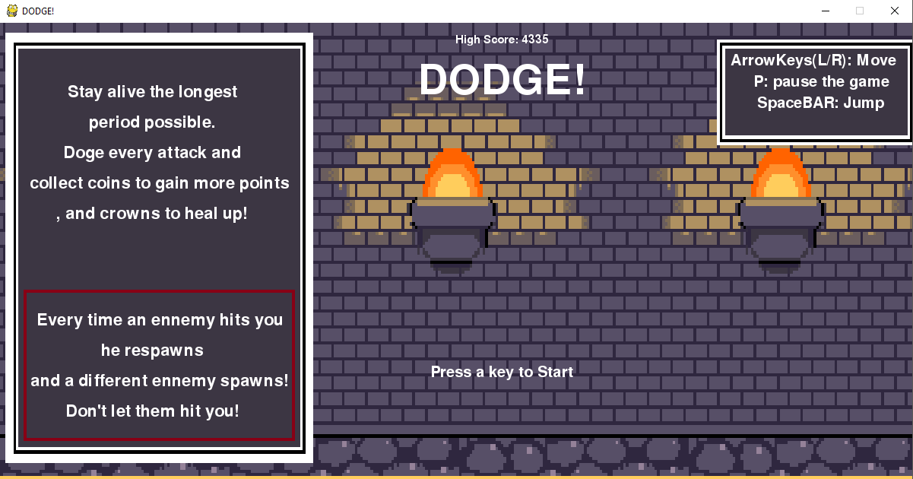
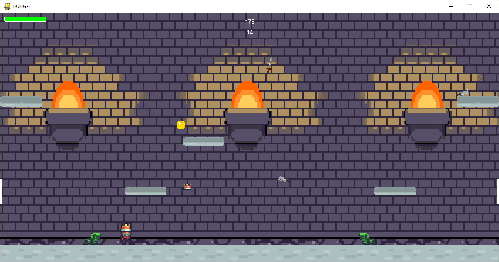
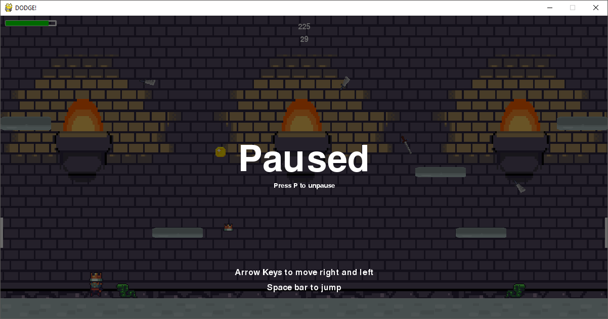
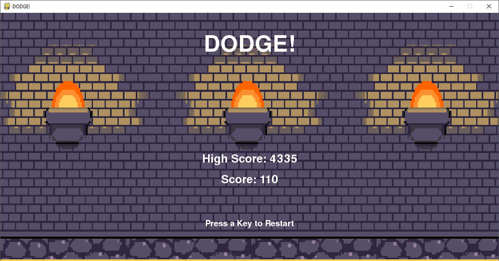

# Dodge_Python
A simple but complex game where the player needs to stay alive as long as possible by dodging all enemies. The game becomes hard as time goes by, by itself.

## Libraries

I used python3 to create this project, and [Pygame](https://github.com/pygame/pygame) as the main library.

>   pygame is a free and open-source cross-platform library for the development of multimedia applications like video games using Python. It uses the Simple DirectMedia Layer library and several other popular libraries to abstract the most common functions, making writing these programs a more intuitive task.

I also used `random`, `time`, and `os` for various needs.

## How to run

You have to have Python3 downloaded. Open the file in the [source folder](https://github.com/DYasser/Dodge_Python/tree/main/src) then run it using any IDE.

## Creation Process 

When creating a game one core understanding is to have a game loop. I used a game loop that will continuously be updating each entity used in the project, such as: the player and the enemies. However, only updating values isn't enough I need to show the result in the screen for the player.

```python3
while self.playing:
    self.clock.tick(FPS)
    self.events()
    if not self.paused:
        self.update()
    self.draw()
```
So, as shown above, as long as the player is still playing the program is going to check for events and update the in-game clock and if not paused it will also update as I said before, then after going through all these functions it will draw the result on screen.

Now that I have my game loop I can start creating entities that are going to live inside my game. But, before that, I am going to create screens (main menu, in-game screen, etc) 

The first important screen that I need to have is a main menu:



In this screen I display the rules of the game, how to control the character, and a the actual highscore.

```python3
def show_start_screen(self):
    # game splash/start screen
    backG = pg.transform.scale(pg.image.load(path.join(img_dir, "Background31.png")).convert(), (WIDTH,HEIGHT))
    backG_rect = backG.get_rect()
    self.screen.blit(backG, backG_rect)
    print_text(self.screen, "SpaceBAR: Jump",30, WIDTH-121, 100)
    [...]
    print_text(self.screen,"High Score: " + str(self.highscore), 22, WIDTH / 2+60, 15)
    pg.display.flip()
    time.sleep(0.25)
    self.Waiting()
```
We can see above the function definition of how I coded the main menu screen. I first load the image using `path` from the `os` library. I then print all the text needed such as the rules, commands, or the highscore. After that, I `flip` the canvas, so in other words I update the canvas to show the result to the player. 

The game stays in this state until the user presses a key.

> The other screens were coded in the same way, so there is no need to focus on those. Instead, I will show how I created other more important features.

Now that I have my way to create screens, I need to have entities moving and living there. So, I first create the player.

```python3
class Player(pg.sprite.Sprite):
    def __init__(self, game):
        self.game = game
        pg.sprite.Sprite.__init__(self)
        Player_img = pg.transform.scale(pg.image.load(path.join(img_dir, "king_right.png")).convert(),(P_width,P_height))
        self.image = Player_img
        self.image.set_colorkey(WHITE)
        self.rect = self.image.get_rect()
        self.rect.center = ((WIDTH/2),(HEIGHT/2))
            #initial position of the player
        self.pos = vec(WIDTH/2,HEIGHT-50)
        self.vel = vec(0,0)
        self.acc = vec(0,0)
        [...]
```

Each entity is a class, and have definite properties that are very specific to it. In the initialization, I load an image (king image) and use image functions to make transparent all the white pixels. I then assign an initial position, a velocity vector, and an acceleration vector. 

Vectors are easy to manipulate and perfect to get the motion we need for a jump or movement.

After multiple tries, I got the most perfect properties values for the player. Now, the player is able to move freely in an empty map.

```python3
# Player properties
P_width = 37
P_height = 60
PLAYER_GRAV = 0.8
PLAYER_ACC = 1
PLAYER_FRICTION = -0.12
PLAYER_JUMP = 14
```

Moving on to the enemies, I used the same type method to get the results I wanted. I created then platforms (for the player to jump on), portals (that would teleport the player from one place to another, snakes (enemies that slither from right to left), and blades that are spawning randomly from above and falling down. I also created coins that will spawn randomly inside the possible to acces places in the map, and crowns that heal the player after being hit from an enemy.

We can see here all these entities mentioned.



## GamePlay

The goal is simple as said earlier, but the game logic is a little bit more complex than what I mentioned.

The score get added each time a blade touches the ground, so each time the player is able to avoid it successfully. However, if the player touches a blade he/she loses health points but more importantly the game becomes harder. See, each time a blade hits the player a snake gets added to the initial 2 snakes. Same goes for snakes, each time a snake hits the player a blade gets added to the initial 3 blades that are at the beginning.

This is why I said it is a little bit complex, because the game starts to advance in difficulty by itself.

At any moment the player is able to pause the game simply by clicking at one button to get to see thise screen.



After losing all his/her health points, the player gets to see his score, and compare it to the highscore that is saved locally. Here is a preview of Game Over screen.



>     this is the end of the documentation
